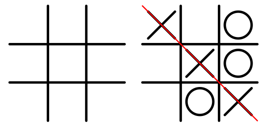

# Run program

- pnpm install
- pnpm run dev

# Run tests

- pnpm test

# What I have done

I created a fun, pretty and colorful Tic Tac Toe game.
I used styled-components to scope my styles, I usually use css-modules but though it would be fun to try styled-components for this project.
I put all my re-usable components in a component folder.
I put my layout in a layout folder (this component is npt reusable)
I have a SVG sprite for my svgs.
I put my calculations in a utils file. In a bigger project it would rather be a utils folder with several files with different util functions, but for thois project I decided to keep them all in one file.

# I got stuck on

Because the project was named Interview%20Test/Interview Test I got problems trying to run the tests and this took me to much time (hours) to figure out. the %20 was read as " " sometimes and "%20" at other times. So when I finally figured that out and renamed the project the tests worked fine.

I also spent to much time on trying to make a animating SVG background. I never done this before and I really wanted the X and Os to animate on change of player, instead of just changing like today. I would also like to use the svgs from the sprite-sheet as background images.

# What I would like to do more (if I did not get stuck with the test-problem above)

I would like to hanle tie better, do a better check and write tests for it.
I would like to tweek animations more - but it's a never ending project I realized.
There are two jumps when clicking Play and the first cell the first time the user play the game (and maybe on some other places aswell). Its annyong and something I would like to fix. If I remove the Background component wrapping everyting it goes away. But I did not have time to investogate more at the moment.

I figured its better to send you my solution now instead of taking more time.

# Assigment

The final goal of this take-home assessment is having a functional Tic-tac-toe game. The game should be playable by 2 players on the same computer and we recommend that you don’t spend more than a couple of hours on it. The requisites are the following:

1. Written in Typescript and React
1. Commit as much as possible to show your line of thought (don’t need to worry about having working parts or💩, we just want to understand how you think and how your solution evolves)
1. Have a board to play the tic tac toe game
1. See which players turn it is (you can use Placeholder indicators, For example, Player 1 / Player 2)
1. Have an indicator of which player won (Preferably animate it in) and witch line on the board is the winning line.
1. Have an indicator if it is a draw (Preferably animate it in)
1. Have a reset button to reset the game (it starts the game over)
1. Keep a score of how many times Player 1 or Player 2 won, between games (does not need to persist between page refresh)

### UI/UX:

There is no design for this, but we would like to see a decently looking tic tac toe game.  
You do not need to focus on responsive design (you can assume Laptop screens), but we would like to put emphasis on animations.

### Add test coverage:

The application should have test coverage to test that the game works correctly: (Check for a Draw, Vertical Line win, Horizontal line win, Diagonal line win) (you can use any tool for writing tests)

## Evaluation criteria

Your final solution will be evaluated accordingly to the following criteria's (in order of importance):

1.  Functional game
2.  UI/UX animations
3.  Code quality / clean code etc
4.  Test coverage

## How to submit

After your solution is ready you can open a pull request to this same repository. Our team will review and write a few comments/requests (like a real-life PR)
